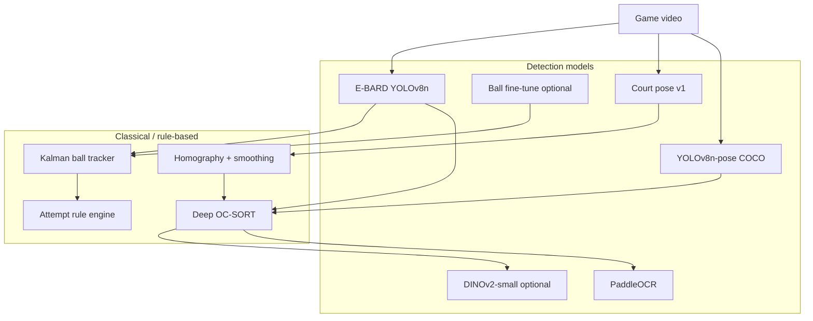

# Models & Design Decisions

Technical reference for every ML model, classical algorithm, and major architectural choice in the `yolo/` worker. This document explains **what** each component does and **why** it was built that way.

For operational how-to on player tracking, see [PLAYER_MOVEMENT.md](PLAYER_MOVEMENT.md). For CLI commands, see the [main README](../README.md).

## Table of contents

1. [System overview](#system-overview)
2. [Model inventory](#model-inventory)
3. [Model reference](#model-reference)
4. [Pipeline design decisions](#pipeline-design-decisions)
5. [Subsystem deep dives](#subsystem-deep-dives)
6. [Configuration philosophy](#configuration-philosophy)
7. [Training & datasets](#training--datasets)
8. [Iteration history & known tradeoffs](#iteration-history--known-tradeoffs)
9. [Local-only assets](#local-only-assets)
10. [Related documentation](#related-documentation)

---

## System overview

The `yolo/` package is a **standalone Python worker** for basketball video analysis. It is not a single monolithic model — it is a **composition of specialized detectors, trackers, geometric solvers, and rule engines** wired together with explicit JSON artifacts between stages.



**Design principle:** Prefer **interpretable, stage-separated pipelines** over end-to-end black boxes. Each stage writes JSON that can be inspected, replayed, and re-run independently.

---

## Model inventory

| Model / component | File / source | Task | Required? | Trained locally? |
|-------------------|---------------|------|-----------|------------------|
| **E-BARD YOLOv8n** (`BODD_yolov8n_0001.pt`) | [Hugging Face](https://huggingface.co/GabrieleGiudici/E-BARD-detection-models) | Ball, hoop, player, referee detection | Yes (base) | No — download |
| **Ball fine-tune** (`ball_finetuned_v*.pt`) | Roboflow + E-BARD init | Improved ball detection | Optional | Yes |
| **Court pose v1** (`court_pose_v1.pt`) | Roboflow Court Detection V3 + `yolov8n-pose` init | Paint (D) 4-corner keypoints | Yes for zoom-aware court | Yes |
| **YOLOv8n-pose** (`yolov8n-pose.pt`) | Ultralytics COCO pretrained | Player ankle feet + torso crops | Default on | No — auto-download |
| **DINOv2-small** (`facebook/dinov2-small`) | Hugging Face Transformers | Team classification (alt. to color) | Optional | No — download |
| **PaddleOCR** | PaddlePaddle | Jersey number OCR | Optional (default on) | No — pip install |
| **Deep OC-SORT** | Ultralytics tracker YAML | Multi-player identity tracking | Default | No — config only |
| **Kalman filter** | filterpy | Ball gap-fill between detections | Built-in | N/A |
| **Lucas–Kanade optical flow** | OpenCV | Court keypoint warp on missed frames | Built-in | N/A |

**Non-ML components worth naming:** homography (`cv2.findHomography`), paint quad EMA/hysteresis/ramp, HSV/Lab K-means team clustering, rule-based shot attempt detection.

---

## Model reference

### E-BARD YOLOv8n (`BODD_yolov8n_0001.pt`)

- **Origin:** [E-BARD detection models](https://huggingface.co/GabrieleGiudici/E-BARD-detection-models) (CC-BY-4.0), Gabriele Giudici et al.
- **Architecture:** YOLOv8n (~6 MB)
- **Classes used:** `basketball`, `hoop`, `player`, `referee` (referee optional in player pipeline)
- **Download:** `python worker/scripts/download_model.py`

**Where it runs:**

| Pipeline | Classes | Confidence defaults |
|----------|---------|---------------------|
| Ball track (`main.py`) | basketball | `conf=0.20` |
| Shot attempts (`detect_attempts.py`) | basketball + hoop | `ball_conf=0.05`, `hoop_conf=0.60` |
| Player movement (`track_players.py`) | player | `conf=0.35` |

**Why E-BARD as the backbone:**

- Public, basketball-specific weights — no need to train player/hoop from scratch.
- Single model serves ball, hoop, and player pipelines (different class filters).
- Small enough for laptop GPU (MPS/CUDA); **CPU inference is intentionally disabled** (`detector.resolve_inference_device`) to keep latency predictable on Apple Silicon / NVIDIA.

---

### Ball fine-tune (`ball_finetuned_v*.pt`)

- **Init weights:** E-BARD `BODD_yolov8n_0001.pt` (not COCO)
- **Dataset:** Roboflow export `Finetune E-BARD.v1i.yolov8` (single-class ball bbox)
- **Training:** `prepare_ball_dataset.py` → `train_ball_model.py`
- **Output:** `worker/models/ball_finetuned_v1.pt` (README references up to `v3` in some scripts)

**Why fine-tune separately:**

- E-BARD ball recall drops on small/blurred balls at broadcast distance.
- Hoops remain on E-BARD — **hybrid detector** (`HybridBallHoopDetector`) runs fine-tuned ball + E-BARD hoop in one pipeline without retraining hoop class.
- Fine-tuning from E-BARD (not COCO) preserves shared feature space and hoop compatibility.

**Hybrid design:**

```
HybridBallHoopDetector
  ├── BallDetector(ball_finetuned)     → basketball
  └── EbardDetector(BODD)            → hoop
```

Both support **hoop-region crop fallback**: when full-frame ball misses, detect on a 3.5× expanded crop around the active hoop (ball appears larger in pixels).

---

### Court pose v1 (`court_pose_v1.pt`)

- **Init weights:** Ultralytics `yolov8n-pose.pt`
- **Dataset:** Roboflow **Court Detection V3** — class `court`, **4 keypoints** (paint quadrilateral corners)
- **Training:** `prepare_court_dataset.py` → `train_court_model.py`
- **Default training:** 100 epochs, imgsz 640, batch 8, patience 20

**Why pose (keypoints) instead of bbox-only court detection:**

- A bounding box does not encode court orientation or perspective.
- Four paint corners define a **homography** to real court meters — required for player `(x, y)` on a top-down diagram.
- Pose model outputs are noisy; downstream **snap + score + smooth** (see Court subsystem) stabilize geometry.

**Post-model geometry (not learned):**

| Step | Purpose |
|------|---------|
| **Edge snap** | Shift keypoints onto strong floor-line gradients |
| **Overlay scoring** | Reject degenerate homographies (folded/collapsed quads) |
| **LK optical flow** | Warp last good quad when pose confidence drops |
| **Paint EMA + hysteresis + ramp** | Stabilize homography timeline for player projection |

Flow-warped frames are tagged `source: "flow"`. Player meters **ignore flow** — flow quads jitter and would move all players together.

---

### YOLOv8n-pose (COCO-17)

- **Source:** Ultralytics pretrained on COCO persons
- **Used in:** `player_pose.py` only (not court)

**Two roles:**

1. **Foot point:** Midpoint of **both** confident ankles (indices 15, 16). Single-ankle midpoint was rejected — it flickers and pulses court Y.
2. **Torso crop:** Shoulders + hips define a jersey rectangle for team color (tighter than full bbox).

**Design choice:** Pose runs **once per frame** on the full image, then matched to player boxes by IoU — cheaper than per-player pose crops and sufficient at 10 fps.

**Fallback:** Bbox bottom-center foot + proportional chest rectangle when pose misses or `--no-pose`.

---

### DINOv2-small (`facebook/dinov2-small`)

- **Optional** team path (`team.method: "dino"`)
- **Default path:** jersey **color** K-means (no transformer inference)

**Why color is default:**

- Faster, no Hugging Face model download at runtime.
- Works when kit colors are distinct (typical broadcast).
- DINO path reserved for hard cases (similar hues, lighting shifts) or when kit book provides reference embeddings.

**Kit book:** Local `kit_book.json` + `kits/` images map clusters to named teams (`home`, `away`). Both paths can use Lab distance to kit prototypes.

---

### PaddleOCR

- **Role:** Jersey number reading on **best-K sharp crops** collected during tracking
- **Not per-frame:** OCR runs once at `finalize()` to avoid latency in the hot loop
- **Voting:** Confidence-weighted majority; misreads need sustained evidence to win

**Why selective OCR:**

- Numbers are often occluded, motion-blurred, or facing away.
- Scoring crops by bbox height + Laplacian sharpness concentrates OCR budget on readable frames.

---

### Deep OC-SORT (player tracking)

Configured via generated YAML from `TrackingConfig` (`player_tracker.write_tracker_yaml`).

| Parameter | Default | Rationale |
|-----------|---------|-----------|
| `tracker_type` | `deepocsort` | Appearance ReID reduces ID swaps vs ByteTrack on same-color jerseys |
| `with_reid` | true | Reuses YOLO backbone features (`reid_model: auto`) |
| `appearance_thresh` | 0.92 | Stricter than Ultralytics 0.9 — same-team kits look alike |
| `gmc_method` | `sparseOptFlow` | Sideline broadcast pans; compensate camera motion |
| `track_buffer` | 90 | ~9 s at 10 fps — survive occlusions / walk off frame |
| `track_high_thresh` | 0.5 | Balance precision vs recall for track birth |

**Why not train a custom tracker:** OC-SORT family + ReID is standard for sports MOT; effort went into detection quality, court geometry, and post-merge instead.

**Alternative:** `tracker_type: bytetrack` available for A/B via config.

---

### Kalman ball tracker

- **State:** `[x, y, vx, vy]` in normalized image coordinates
- **Gap fill:** Predict up to 8 frames without detection; **20 frames** when ball appears in shot flight toward hoop
- **No learned model:** Constant-velocity assumption + tuned process noise

**Why Kalman for ball but EMA/homography smoothing for players:**

- Ball is a single point with fast motion and frequent occlusion — Kalman predict is standard.
- Players need persistent IDs across frames — that's a tracking association problem, not filtering alone.

---

## Pipeline design decisions

### 1. Stage-separated JSON artifacts

| Artifact | Producer | Consumer |
|----------|----------|----------|
| `court_detect.json` | `detect_court.py` | `track_players.py`, overlay video |
| `player_movement.json` | `track_players.py` | `play-renderer.html`, `play-diagram.html` |
| `ball_track.json` | `main.py` | downstream analytics |
| `attempts.json` | `detect_attempts.py` | visualization, stats |

**Why:** Re-run player tracking with different smoothing or team settings without re-running court detect or YOLO inference on the full clip.

### 2. Two court mapping modes

| Mode | Input | Zoom-aware? | When to use |
|------|-------|-------------|-------------|
| **Static calibration** | `court_calibration.json` from `court-marker.html` | No | Fixed camera, manual markers trusted |
| **Court detect** | `court_detect.json` | Yes | Broadcast pan/zoom (typical) |

**Decision:** `--court-detect` takes precedence over `--calibration`. Static calib was smooth but wrong under zoom for clips like `new.mp4`.

### 3. Normalized coordinates everywhere

Detections, keypoints, and foot points are stored **0–1 relative to frame width/height**. Homography maps normalized pixels → court meters.

**Why:** Same calibration works regardless of `maxWidth` downscale — as long as court detect and tracking use the **same** `maxWidth`.

### 4. Drop, don't snap

Points projected outside court ± margin are **dropped**, not clamped to the baseline.

**Why:** Edge snapping caused visible Y-axis pulses when homography wobbled — players appeared to teleport to the sideline.

### 5. GPU-only inference

`resolve_inference_device` rejects `cpu`.

**Why:** These pipelines target interactive iteration on MPS/CUDA; CPU would be too slow for 10 fps multi-model inference.

### 6. Referees off by default

`detect_referees: false` in player pipeline.

**Why:** Striped/grayscale officials confuse K-means team clustering and renderer color coding.

### 7. HTML tools for human-in-the-loop

| Tool | Purpose |
|------|---------|
| `hoop-marker.html` | Manual hoop locations + court polygon |
| `court-marker.html` | Static homography calibration |
| `play-renderer.html` | Replay `player_movement.json` |
| `play-diagram.html` | Movement + play reconstruction |

**Why:** Some geometry (hoop ROI, kit colors) is faster to mark manually than to infer reliably from video alone.

### 8. Wheelchair attempt detector as fork

`wheelchair_attempt_detector.py` duplicates `attempt_detector.py` structure.

**Why:** Wheelchair full-court left-camera layout needs independent iteration without risking the standard attempt pipeline.

---

## Subsystem deep dives

### Ball tracking & shot attempts

```
Video → E-BARD (or hybrid ball) → Kalman → ball_track.json
Video → E-BARD hoop + ball → Kalman → rule engine → attempts.json
```

**Attempt detection** is **rule-based**, not a classifier:

- Rim crossing with lookback
- Rim approach path for under-basket layups
- Full-court: cluster hoop detections into two basket locations; pick **active shooting hoop** per frame (detected hoop or nearest to ball)
- Cooldown + dedupe to avoid double-counting

**Hoop ROI:** Optional `hoop_roi.json` from `hoop-marker.html` — manual hoops, court polygon, or both. Polygon filters ball detections outside the playing surface.

### Court detection & overlay

```
Video → court_pose_v1 → snap → score → [flow warp if miss] → court_detect.json
court_detect.json → paint EMA/hysteresis/ramp → PoseCourtProjector → player (x,y)
```

**Court presets** (`court_overlay.PRESETS`): `fiba`, `nba`, `fibaHalf`, `nbaHalf`, `fiba3x3` — regulation dimensions drive overlay arcs, paint, and rim geometry.

**Keypoint order:** Default `0,1,2,3` = base-left, base-right, ft-right, ft-left. Auto permutation search available when `--keypoint-order auto`.

**Homography smoothing layers** (player movement quality):

1. Paint quad EMA
2. Hysteresis (K frames above drift threshold)
3. Ramped quad blend (N frames)
4. Fast adopt on large drift (real zoom)
5. Per-track court xy EMA after projection
6. Per-track foot pixel EMA before projection

See [PLAYER_MOVEMENT.md § Homography smoothing](PLAYER_MOVEMENT.md#homography-smoothing).

### Player movement

Full per-point algorithm documented in [PLAYER_MOVEMENT.md § Per-point algorithm](PLAYER_MOVEMENT.md#per-point-algorithm).

**Post-track processing:**

| Stage | Purpose |
|-------|---------|
| Filter | Drop short tracks, off-court fractions, non-players |
| Team classify | K-means + kit book |
| Jersey OCR | PaddleOCR vote |
| Merge | Reconnect broken IDs (jersey > color > gap geometry) |
| Gap fill | Interpolate px/py, re-project court xy at each t |

**Merge signals (priority):**

1. Same jersey number + same team + plausible gap
2. Same team + similar jersey color + plausible speed/distance
3. Conflicting jersey vs null allowed; both null needs color agreement

### Team classification

**Color path (default):**

1. Torso crop (pose or rectangle)
2. HSV chromatic mask — exclude skin, blown highlights, floor shadow
3. Dominant Lab color per observation
4. K-means across tracks (`kmeansClusters`, default 3 for refs + 2 teams)
5. Map clusters to kit book names via Lab distance
6. Low-saturation tracks → possible referee label

**DINO path:** Encode best-K torso crops → cluster embeddings → cosine match to kit prototypes.

---

## Configuration philosophy

All player pipeline stages share one **`PipelineConfig`** JSON (`player_config.py`, Pydantic v2):

```
detection → tracking → homography → team → jerseyOcr → merge
```

CLI flags override file values (`apply_cli_overrides` in `track_players.py`).

**Why typed config:**

- Reproducible runs — full config snapshot embedded in `player_movement.json`
- Section boundaries match code modules
- Sensible defaults for broadcast sideline footage without tuning

Ball/attempt pipelines use separate schemas in `schemas.py` (`DetectorConfig`, `AttemptDetectionConfig`, etc.).

---

## Training & datasets

### Ball fine-tune

```bash
python worker/scripts/prepare_ball_dataset.py   # Roboflow → train/val split
python worker/scripts/train_ball_model.py       # E-BARD init, 80 epochs, imgsz 512
```

- Source: `worker/models/Finetune E-BARD.v1i.yolov8`
- Single class (ball); empty labels kept as hard negatives
- Artifacts: `worker/models/runs/ball_finetune/`

### Court pose

```bash
python worker/scripts/prepare_court_dataset.py  # Court Detection V3 → train/val
python worker/scripts/train_court_model.py      # yolov8n-pose init, 100 epochs
```

- Source: `Court Detection V3.yolov8/` (Roboflow export, gitignored)
- Class 0 = court, 4 keypoints × (x, y, visibility)
- Artifacts: `worker/models/runs/court_pose/` → `court_pose_v1.pt`

### What we deliberately do not train

| Component | Approach instead |
|-----------|------------------|
| Player detector | E-BARD off-the-shelf |
| Player tracker | Deep OC-SORT config tuning |
| Team classifier | K-means / DINO + kit book |
| Jersey OCR | PaddleOCR zero-shot |
| Shot attempts | Rule engine on ball track |
| Homography smooth | Hand-tuned EMA/hysteresis/ramp |

---

## Iteration history & known tradeoffs

Documented issues encountered during development of the player movement pipeline and their fixes:

| Symptom | Root cause | Mitigation |
|---------|------------|------------|
| All players pulse on court Y | Per-frame homography jitter from pose keypoints | Paint EMA, hysteresis, ramped H adopt |
| All players slide together | Flow-warped court quads adopted into H | Ignore `source: flow` in `PoseCourtProjector` |
| Single player Y flicker | One ankle vs two ankle foot point | Require both ankles; bbox fallback |
| Players snap to baseline | `clampToCourt` snapping | Default `clampToCourt: false` — drop instead |
| Smooth but wrong court position | Static calibration under zoom | Switch to `--court-detect` |
| Wrong team colors | Bbox feet changed on-court filter → different torso samples | Restore pose ankles + kit book |
| Track ID fragments | Occlusion / leave frame | Merge + gap fill + long `trackBuffer` |
| Minor H bumps after smooth | Discrete H adopt steps | Ramp + court xy EMA |

**Remaining limitations:**

- Homography quality depends on visible paint — partial court / extreme angles degrade meters.
- Same-color jerseys + no OCR → merge may over- or under-connect tracks.
- Jersey OCR is best-effort on broadcast resolution.
- No single `run_pipeline.py` command yet — court detect and track are two CLIs by design.

---

## Local-only assets

Gitignored (see `yolo/.gitignore`):

| Path | Contents |
|------|----------|
| `*.pt`, `*.pth` | All model weights |
| `Court Detection V3.yolov8/` | Roboflow court training export |
| `kits/` | Kit reference photos |
| `kit_book.json` | Team color book (local per venue/teams) |
| `worker/models/Finetune*/` | Ball dataset export |
| `worker/models/*/data.local.yaml` | Prepared datasets |
| `worker/models/runs/` | Training runs |
| `worker/output/**` | Pipeline JSON/MP4 outputs |
| `*.mp4` | Local test clips |

Committed: code, HTML tools, docs, `.gitkeep` placeholders for `models/` and `output/`.

---

## Related documentation

| Document | Contents |
|----------|----------|
| [PLAYER_MOVEMENT.md](PLAYER_MOVEMENT.md) | Operational guide: per-point algorithm, config, troubleshooting |
| [README.md](../README.md) | Setup, CLI commands, training quick start |
| `player_config.py` | Authoritative default values and field aliases |
| `court_overlay.py` | Court presets and overlay geometry |
| `*.spec.py` | Unit tests for projection, overlay, team, track scripts |

---

## Quick reference: which model for which script

| Script | Models invoked |
|--------|----------------|
| `main.py` | E-BARD → Kalman |
| `detect_attempts.py` | E-BARD or hybrid ball + E-BARD hoop → Kalman → rules |
| `detect_attempts_wheelchair.py` | Same (forked rules) |
| `detect_court.py` | court_pose_v1 → snap/flow/score |
| `track_players.py` | E-BARD → Deep OC-SORT → yolov8n-pose → homography → K-means/DINO → PaddleOCR |
| `draw_ball_hoop_boxes.py` | E-BARD or hybrid |
| `eval_ebard.py` / `sweep_conf.py` | E-BARD metrics |
